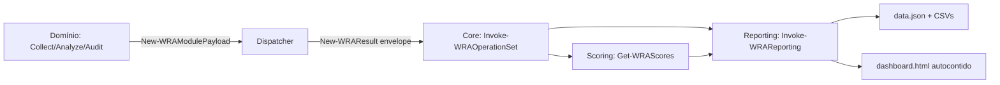

# Windows Resource Auditor v4.1.0 — Integração Geral

Este documento consolida a **integração** entre todos os componentes construídos
nas etapas 1–14 e registra a **verificação estática** executada para comprovar
que as peças se encaixam. Como o ambiente de construção não dispõe de um host
PowerShell, a conformidade foi validada por análise cruzada de código-fonte
(definições × exportações × chamadas × chaves de configuração), além de testes
de renderização do dashboard (jsdom) e de boa-formação do XML de tarefas.

## 1. Topologia dos componentes

```
Launcher.bat ──► Core.ps1 (composition root)
                   │
                   ├── Infraestrutura (Import-Module -Global, ordem: Contracts → Infrastructure)
                   │     Contracts:    Common · ResultEnvelope · ModuleContract
                   │     Infrastructure: Configuration · Logger · Dispatcher · RunspaceManager
                   │                     Scoring · Reporting · Scheduler · Triggers
                   │
                   ├── Domínio (auto-registro via Dispatcher: Register-WRAModules)
                   │     Monitor · ProcessAnalyzer · Network · Security · Inventory
                   │
                   └── Apresentação
                         Scoring ──► Reporting ──► Templates/Assets ──► Reports/<RunId>/dashboard.html
```

## 2. Fluxo de dados (contrato do envelope)

Cada operação de domínio retorna um **payload** (`New-WRAModulePayload`) que o
Dispatcher encapsula no **envelope universal** (`New-WRAResult`). O Core coleta os
envelopes e os repassa a Scoring e Reporting. Os nomes de campo são idênticos da
produção ao consumo — verificado:

| Campo do envelope | Produzido por `New-WRAResult` | Consumido por Scoring/Reporting |
|---|---|---|
| `Success`      | sim | sim |
| `Module`       | sim | sim |
| `Operation`    | sim | sim |
| `Duration`     | sim | sim |
| `Timestamp`    | sim | (meta do relatório) |
| `ComputerName` | sim | sim |
| `Data`         | sim | sim |
| `Warnings`     | sim | sim |
| `Errors`       | sim | sim |

O Reporting reindexa os envelopes em `modules[<Nome>] = { success, operation,
durationMs, warnings, errors, data }`, injeta o conjunto como JSON no
`dashboard.html` (com `<` escapado para `\u003c`) e o `dashboard.js` lê
`modules.<Nome>.data` para renderizar cada seção.



## 3. Modos de execução do Core

| Comando | Parâmetro | Caminho | Instância única |
|---|---|---|---|
| Auditoria | `-Run <itens>` | OperationSet → Reporting | sim (mutex) |
| Listar módulos | `-ListModules` | Get-WRAModuleRegistry | não |
| Instalar agenda | `-InstallSchedule` | Install-WRASchedule | não |
| Remover agenda | `-RemoveSchedule` | Remove-WRASchedule | não |
| Listar agenda | `-ListSchedule` | Get-WRASchedule | não |
| Vigilância | `-Watch` | Start-WRATriggerWatch → callback (OperationSet + Reporting) | sim (mutex) |

A guarda de instância única usa um mutex nomeado com hash MD5 determinístico da
raiz (`Global\WRA_Run_<hash>`, com *fallback* `Local\`), governada por
`General.PreventMultipleInstances`. Conflito resulta no código de saída **38**.

## 4. Resultados da verificação estática

Análise sobre `Core.ps1` e os 16 módulos `.psm1`:

- **Chamadas pendentes**: nenhuma. Toda invocação `Verbo-WRA*`/`Verbo-Core*`
  possui definição correspondente no projeto.
- **Sondagens de contrato do Core** (`Get-Command`): as 14 funções esperadas da
  infraestrutura resolvem — Configuração, Log, Framework de módulos, Relatórios,
  Envelope, Scheduler e Triggers.
- **Exportadas sem definição**: nenhuma.
- **Auto-registro de domínio**: os 5 módulos chamam `Register-WRAModule` e
  produzem `New-WRAModulePayload`.
- **Integridade de configuração**: as 94 referências enraizadas em seções de
  configuração resolvem para chaves existentes no `Config.json` (zero typos que
  cairiam silenciosamente no valor padrão).
- **Coerência de habilitação**: `Modules.Enabled` corresponde exatamente aos
  módulos de domínio presentes em disco.

## 5. Modelo de escopo (PowerShell)

Tanto o Core (infraestrutura) quanto o Dispatcher (domínio) usam
`Import-Module -Force -Global -DisableNameChecking`. Isso publica as funções de
contrato (`Get-WRAProp`, `New-WRAModulePayload`, `New-WRAResult`,
`Register-WRAModule`) no estado de sessão global, tornando-as visíveis ao código
de nível superior dos módulos de domínio no momento da importação — o que é o que
viabiliza o padrão de **auto-registro**. A ordem de carga (Contracts antes de
Infrastructure, e ambos antes do domínio) garante que toda dependência já esteja
publicada quando consumida.

## 6. Pressupostos de runtime (a confirmar em host real, Etapa 16)

- `schtasks.exe` presente (padrão em todas as edições suportadas).
- Para `-InstallSchedule`/`-RemoveSchedule` e o módulo Security, privilégios
  administrativos; sem eles, o comportamento degrada com aviso (Fail Safe).
- Classes CIM de performance (`Win32_PerfFormattedData_*`) disponíveis para
  Monitor e Triggers; ausência degrada graciosamente.

## 7. Rastreabilidade requisito → componente

| Requisito do contrato | Componente |
|---|---|
| Somente leitura, sem auto-modificação | Todos os módulos de domínio |
| Envelope de retorno padronizado | `ResultEnvelope.psm1` + Dispatcher |
| Configuração exclusiva no `Config.json` | `Configuration.psm1` (+ schema) |
| Prioridade CIM > API > … | Monitor/Network/Security/Inventory |
| Relatório HTML/JSON/CSV offline | `Reporting.psm1` + Templates/Assets |
| Agendamento (boot/logon/intervalo/diário/semanal) | `Scheduler.psm1` |
| Gatilhos automáticos por limite | `Triggers.psm1` |
| Instância única | `Core.ps1` (mutex) |
| Compatibilidade PS 4.0+ / x64 | Launcher + Core (subset de sintaxe) |

A suíte está integrada e internamente consistente. A próxima etapa (16) executa a
**bateria de testes** com um runner nativo, sem dependências externas, para
exercitar os contratos em tempo de execução.
