# Windows Resource Auditor (WRA) — v1.1.0

[](LICENSE)
[](CHANGELOG.md)
[](#4-requisitos-mínimos)
[](#4-requisitos-mínimos)

**Um verificador de saúde para o seu computador Windows.** O WRA examina a máquina, monta um relatório visual fácil de ler e mostra, **em primeiro lugar, o que precisa da sua atenção** — sem nunca alterar nada no sistema.

> Pense nele como um "check-up" do computador: ele observa, anota e recomenda — mas quem decide o que fazer é você.

> Desenvolvido por Edsilas.

---

## Índice

1. [O que é o WRA](#1-o-que-é-o-wra)
2. [O que ele faz e o que não faz](#2-o-que-ele-faz-e-o-que-não-faz)
3. [Como funciona (visão rápida)](#3-como-funciona-visão-rápida)
4. [Requisitos mínimos](#4-requisitos-mínimos)
5. [Como usar pela primeira vez](#5-como-usar-pela-primeira-vez)
6. [Entendendo o dashboard (com imagens)](#6-entendendo-o-dashboard-com-imagens)
   - [6.1 Visão geral da tela](#61-visão-geral-da-tela)
   - [6.2 Itens que Requerem Atenção](#62-itens-que-requerem-atenção)
   - [6.3 Resumo do sistema e licença do Windows](#63-resumo-do-sistema-e-licença-do-windows)
   - [6.4 Inventário](#64-inventário)
   - [6.5 Processos](#65-processos)
   - [6.6 Rede](#66-rede)
   - [6.7 Segurança](#67-segurança)
   - [6.8 Eventos](#68-eventos)
   - [6.9 Serviços](#69-serviços)
7. [Fluxo recomendado para interpretar o relatório](#7-fluxo-recomendado-para-interpretar-o-relatório)
8. [Onde os relatórios ficam salvos](#8-onde-os-relatórios-ficam-salvos)
9. [Licenciamento do Windows](#9-licenciamento-do-windows)
10. [Perguntas frequentes e solução de problemas](#10-perguntas-frequentes-e-solução-de-problemas)
11. [Boas práticas](#11-boas-práticas)
12. [Para usuários avançados](#12-para-usuários-avançados)
13. [Versão, licença e créditos](#13-versão-licença-e-créditos)

---

## 1. O que é o WRA

O **Windows Resource Auditor** é um programa que faz uma "fotografia" completa do seu computador Windows: hardware, sistema operacional, programas instalados, o que está em execução, rede, segurança, serviços e os avisos recentes do Windows.

Com base nisso, ele gera um **relatório visual** (uma página que abre no navegador) que começa mostrando **os itens que merecem sua atenção**, em ordem de prioridade. Assim você identifica rapidamente se há algo para verificar ou corrigir — sem precisar interpretar dezenas de números técnicos.

Funciona **sem instalar nada**, **sem internet** e **sem mexer no sistema**.

---

## 2. O que ele faz e o que não faz

**Ele faz:**

- Aponta **o que precisa de atenção primeiro**, do mais urgente ao menos urgente.
- Levanta um **inventário** do computador (peças, sistema, programas).
- Mostra **o que está rodando** (processos e serviços).
- Verifica a **rede** (conexões e portas em uso).
- Confere a **segurança** (antivírus, firewall, atualizações etc.).
- Resume os **avisos do Windows** dos últimos dias.
- Gera um **relatório** para guardar ou anexar a um chamado, com **exportação em Markdown (.md), JSON e CSV**.
- Mostra o **SHA-256 completo** de cada executável em execução, pronto para copiar e verificar.

**Ele NÃO faz (fique tranquilo):**

- **Não altera nada** — só lê e relata.
- **Não instala** programas nem baixa nada da internet.
- **Não envia** seus dados para lugar nenhum.
- **Não corrige sozinho** — recomenda, e você decide.
- **Não é antivírus** — verifica configurações, mas não remove vírus.

---

## 3. Como funciona (visão rápida)

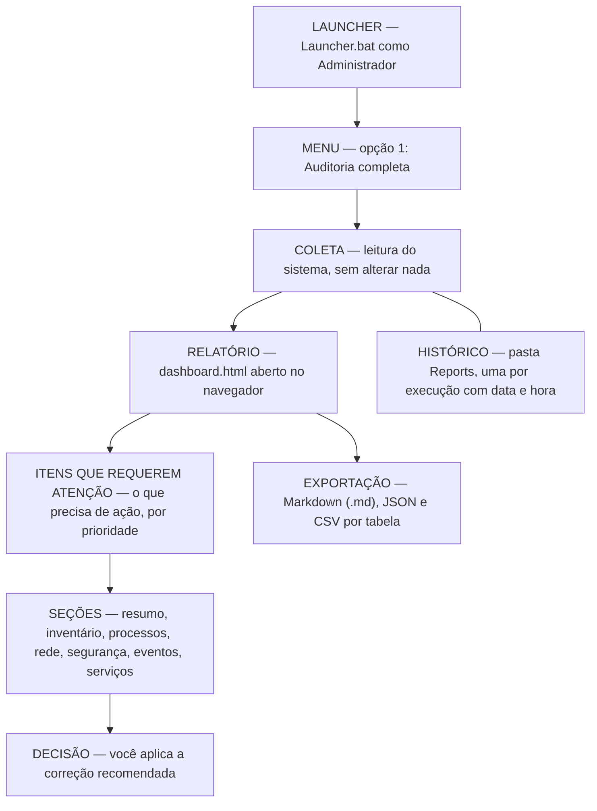

Cada verificação gera um relatório novo, guardado no próprio computador. Você pode repetir quando quiser e comparar com relatórios anteriores.

---

## 4. Requisitos mínimos

| Você precisa de... | Detalhe |
|--------------------|---------|
| Um PC com **Windows** | Windows 10 ou 11, ou Windows Server (2012 até 2025), 64 bits |
| **PowerShell** | Já vem no Windows (o WRA usa o que já existe — 5.1 recomendado, 7+ também funciona) |
| Um **navegador** | Edge, Chrome ou Firefox para abrir o relatório |
| **Permissão de administrador** | Recomendado — assim o WRA consegue verificar tudo |

Não é preciso instalar nada além do que já vem no Windows.

---

## 5. Como usar pela primeira vez

É simples e leva poucos minutos.

**Passo 1 — Coloque a pasta do WRA no computador.** Copie para, por exemplo, `C:\WRA`.

**Passo 2 — Abra como administrador.** Clique com o botão direito em **`Launcher.bat`** e escolha **"Executar como administrador"**. (Se o Windows pedir permissão, confirme.)

**Passo 3 — Escolha o que fazer no menu.** Aparecerá uma janela com o menu. Para um check-up completo, digite **`1`** e tecle **ENTER**:

```
   [1]  Auditoria completa (todos os modulos)
   [2]  Inventario      (hardware, SO, software)
   [3]  Monitoramento   (servicos, processos, eventos)
   [4]  Rede            (interfaces, conexoes, portas, shares)
   [5]  Processos       (analise detalhada e assinaturas)
   [6]  Seguranca       (firewall, BitLocker, contas, updates)

   [7]  Listar modulos disponiveis
   [8]  Abrir ultimo relatorio (dashboard HTML)
   [9]  Agendar execucao automatica (tarefa diaria)

   [0]  Sair
```

**Passo 4 — Aguarde terminar.** Leva de alguns segundos a poucos minutos (há uma barra de progresso).

**Passo 5 — Abra o relatório.** Digite **`8`** e tecle **ENTER** para abrir o relatório no navegador. Ele já abre mostrando os **Itens que Requerem Atenção**.

---

## 6. Entendendo o dashboard (com imagens)

Esta seção percorre cada tela do relatório. As imagens abaixo foram geradas por uma auditoria de exemplo em uma máquina fictícia (`DESKTOP-EXEMPLO`), com alguns problemas propositais para ilustrar.

### 6.1 Visão geral da tela

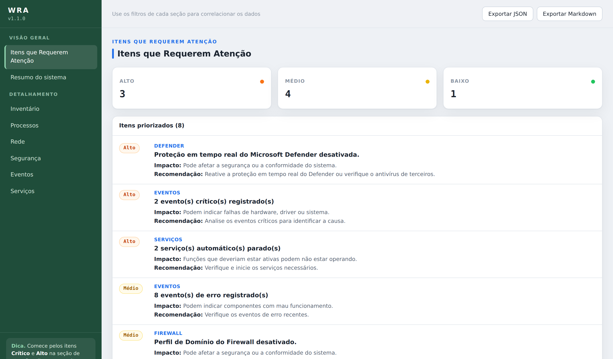

**Objetivo da tela:** dar acesso a tudo em um único lugar. À **esquerda** fica o menu de navegação; à **direita**, o conteúdo. Ao topo há o título, a versão e os botões **Exportar JSON** e **Exportar Markdown**.

- **O que cada informação representa:** cada item do menu leva a uma seção do relatório. A primeira, **Itens que Requerem Atenção**, é o ponto de partida.
- **Como navegar:** clique em um item do menu para rolar até a seção. Dentro das seções, muitos elementos são clicáveis e levam ao detalhe correspondente.
- **Ações possíveis:** **Exportar Markdown** baixa o relatório completo em um arquivo de texto (.md) organizado, fácil de ler, arquivar ou anexar a um chamado; **Exportar JSON** baixa todos os dados brutos.

---

### 6.2 Itens que Requerem Atenção

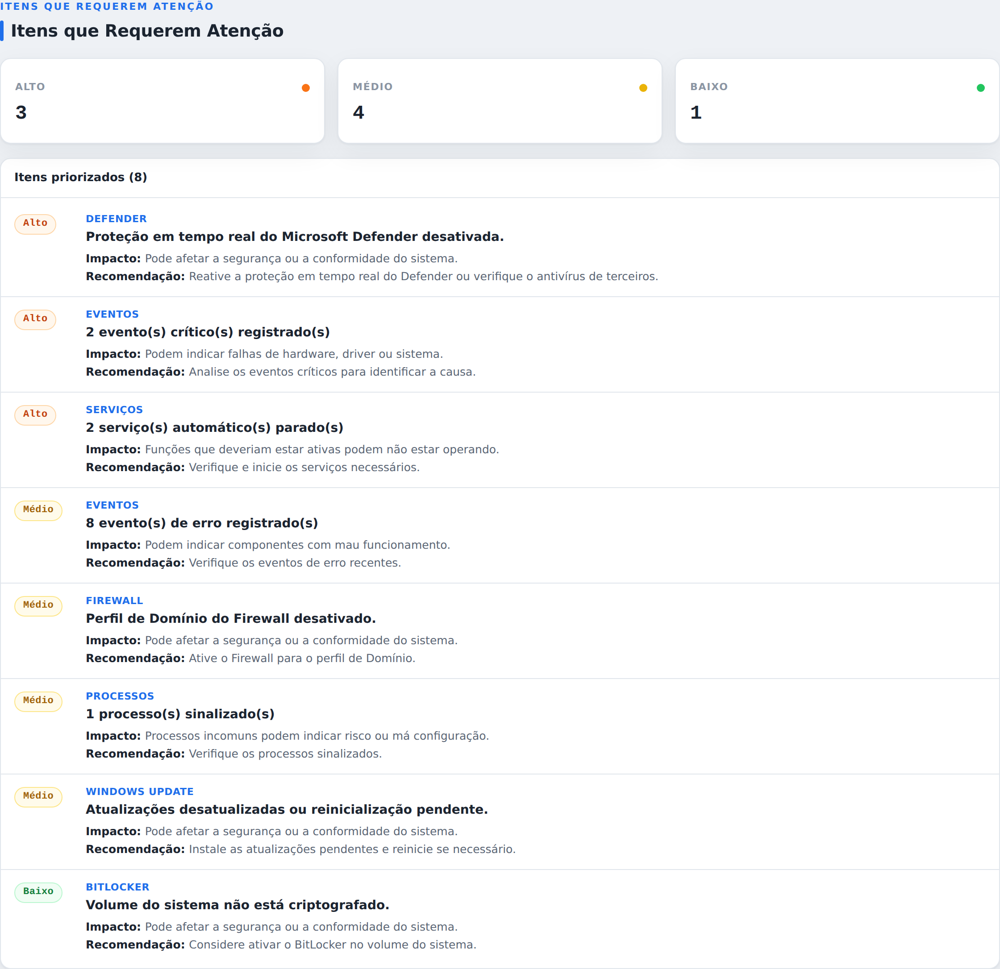

**Objetivo da tela:** mostrar, de forma direta, **tudo o que merece ação** — reunido e ordenado por prioridade. É a tela mais importante do relatório.

- **O que cada informação representa:**
  - No topo, **cartões de resumo** indicam quantos itens existem em cada prioridade (Crítico, Alto, Médio, Baixo, Informativo).
  - Abaixo, a **lista priorizada**. Cada item traz: uma **etiqueta de prioridade** colorida; o **componente** analisado (ex.: "Serviços", "Defender", "Eventos"); a **situação** encontrada (o título em destaque); o **Impacto** potencial; e a **Recomendação** de correção.
- **Como interpretar as prioridades (cores):**

  | Cor | Prioridade | Significado |
  |-----|-----------|-------------|
  | 🔴 Vermelho | **Crítico** | Precisa de atenção o quanto antes |
  | 🟠 Laranja | **Alto** | Importante, verifique em seguida |
  | 🟡 Amarelo | **Médio** | Vale a pena olhar |
  | 🟢 Verde | **Baixo** | Pouco urgente |
  | 🔵 Azul | **Informativo** | Apenas um aviso, sem gravidade |

- **Cenários/problemas identificáveis:** antivírus desativado, firewall parcialmente desligado, serviços que deveriam estar ativos e estão parados, eventos críticos do Windows, processos suspeitos, licença do Windows a expirar, entre outros.
- **Ações possíveis:** comece pelos itens vermelhos e laranja; **clique** em um item para ir direto à seção com os detalhes; siga a recomendação exibida. Se **não houver nada a corrigir**, o WRA mostra a mensagem *"Nenhum item requer atenção no momento."*

---

### 6.3 Resumo do sistema e licença do Windows

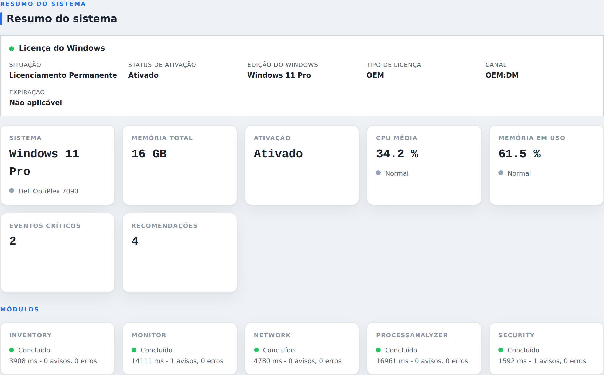

**Objetivo da tela:** dar um panorama geral da máquina e o **estado da licença do Windows**.

- **O que cada informação representa:**
  - **Licença do Windows** (bloco no topo): situação (ex.: *Licenciamento Permanente*), status de ativação, edição instalada, tipo (OEM, Retail, Volume, KMS, Digital, Avaliação), canal e data de expiração (quando houver).
  - **Fatos da máquina:** sistema, memória total, ativação, CPU média, memória em uso, quantidade de eventos críticos e de recomendações.
  - **MÓDULOS:** mostra se cada coletor foi concluído com sucesso, sua duração e quantos avisos/erros teve.
- **Como interpretar:** um ponto colorido ao lado de cada informação indica a situação (verde = normal; amarelo/laranja/vermelho = atenção). Se um módulo aparecer "Com falha" ou com muitos avisos, parte dos dados pode estar incompleta — geralmente por falta de permissão de administrador.
- **Cenários/problemas identificáveis:** Windows não ativado ou perto de expirar; uso de memória/CPU elevado; um módulo que não coletou tudo.
- **Ações possíveis:** clique em "Eventos críticos" ou "Recomendações" para ir ao detalhe; rode como administrador se algum módulo ficou incompleto; ative/renove o Windows se a licença exigir.

---

### 6.4 Inventário

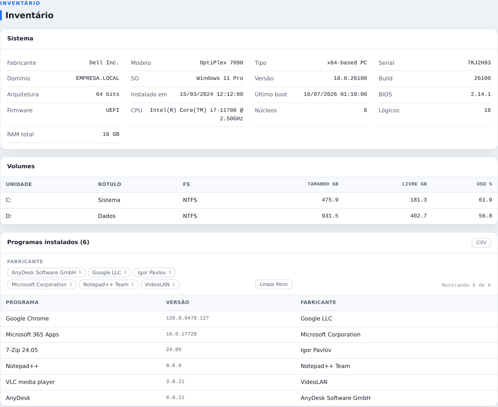

**Objetivo da tela:** documentar **o que o computador tem** — útil para suporte, patrimônio e diagnóstico.

- **O que cada informação representa:**
  - **Sistema:** fabricante, modelo, número de série, domínio, sistema operacional, versão/build, data de instalação, BIOS/firmware, CPU e memória.
  - **Volumes:** cada disco/partição, com tamanho, espaço livre e percentual de uso.
  - **Programas instalados:** nome, versão e fabricante (com filtro por fabricante e exportação em CSV).
- **Como interpretar:** confira se o hardware e o SO correspondem ao esperado; observe volumes com **pouco espaço livre** (uso alto).
- **Cenários/problemas identificáveis:** disco quase cheio; sistema desatualizado; programas indesejados ou desconhecidos instalados.
- **Ações possíveis:** liberar espaço em disco; planejar atualização; revisar programas que não deveriam estar ali.

---

### 6.5 Processos

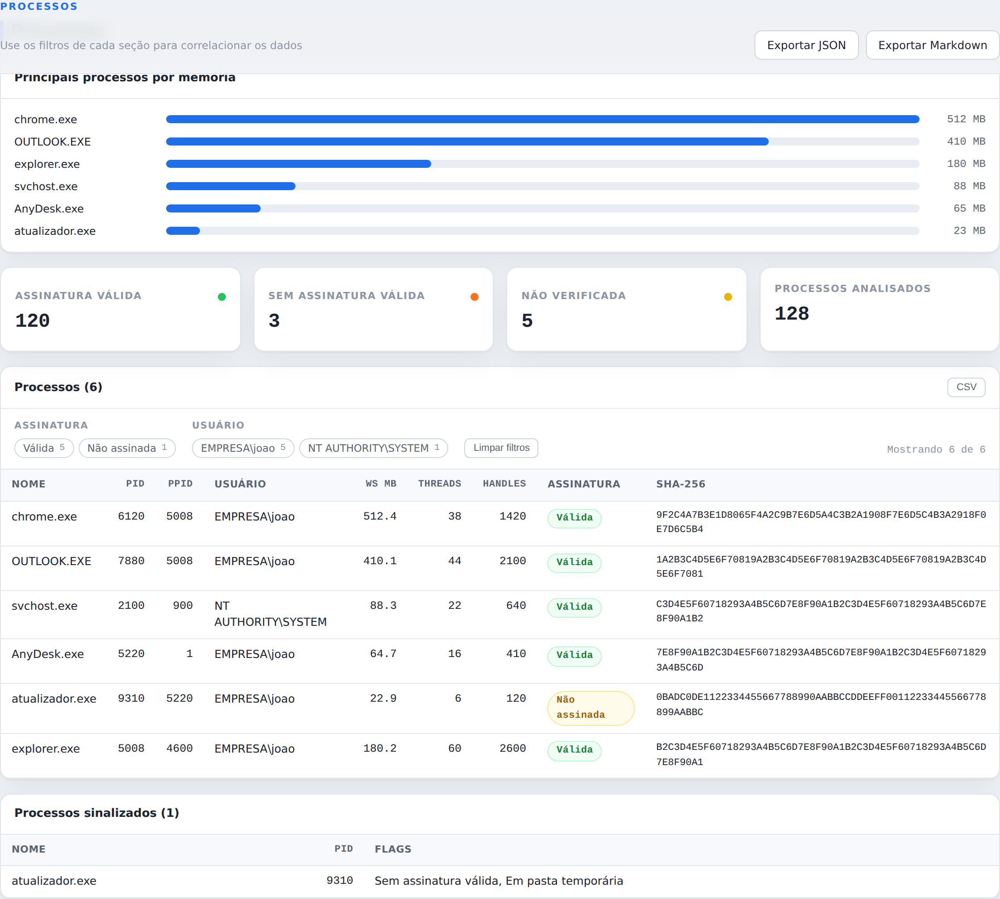

**Objetivo da tela:** mostrar **o que está em execução** e ajudar a identificar processos incomuns.

- **O que cada informação representa:**
  - **Principais processos por memória:** um gráfico de barras com os que mais consomem memória.
  - **Cartões de assinatura:** quantos processos têm **assinatura válida** (confiáveis), **sem assinatura válida**, **não verificada**, e o total analisado.
  - **Tabela de processos:** nome, PID/PPID, usuário, memória, threads, handles, **assinatura digital** e **SHA-256** (identificador único do arquivo). O hash é exibido por completo — um clique sobre a célula seleciona o valor inteiro, pronto para copiar.
- **Como interpretar:** "Assinatura válida" indica binário assinado e confiável; **"Não assinada"** merece atenção (especialmente em locais incomuns); **"Não verificada"** significa apenas que a checagem não pôde ser concluída — não é, por si só, um problema.
- **Cenários/problemas identificáveis:** processo sem assinatura rodando de uma pasta temporária; consumo de memória anormal; processo desconhecido com muitas conexões.
- **Ações possíveis:** investigar processos sem assinatura válida; usar o SHA-256 para pesquisar a reputação do arquivo; encerrar/analisar o que for suspeito. (O WRA não encerra nada — a ação é sua.)

---

### 6.6 Rede

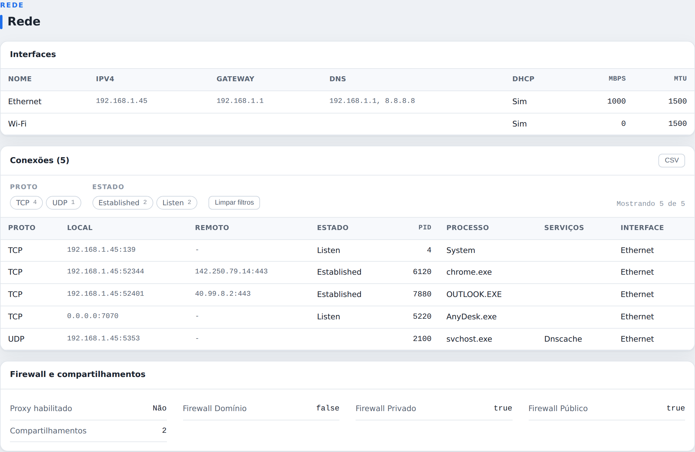

**Objetivo da tela:** mostrar como o computador está **conectado** e o que está **ouvindo/comunicando** na rede.

- **O que cada informação representa:**
  - **Interfaces:** placas de rede, IP, gateway, DNS, DHCP, velocidade e MTU.
  - **Conexões:** protocolo, endereço local, endereço remoto, estado, processo dono e interface. Estado **Listen** = a máquina está aguardando conexões naquela porta; **Established** = conexão ativa.
  - **Firewall e compartilhamentos:** situação de cada perfil do firewall e quantos compartilhamentos existem.
- **Como interpretar:** correlacione a **porta em escuta** com o **processo dono** — portas abertas por programas conhecidos são normais; abertas por processos desconhecidos merecem verificação.
- **Cenários/problemas identificáveis:** perfil de firewall desativado; porta aberta por um programa de acesso remoto; conexões inesperadas.
- **Ações possíveis:** ativar o firewall no perfil correto; revisar portas/serviços expostos; investigar o processo dono de uma conexão suspeita.

---

### 6.7 Segurança

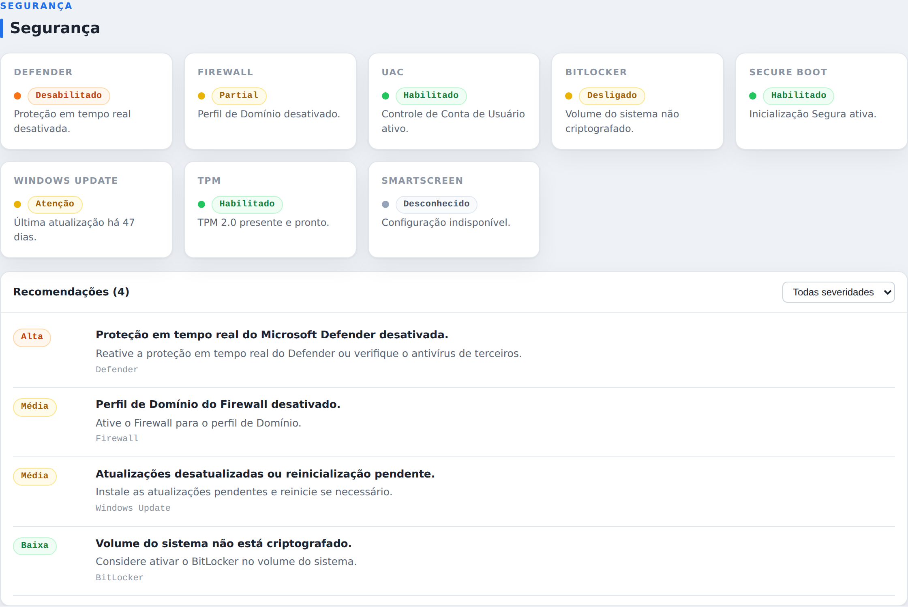

**Objetivo da tela:** avaliar a **postura de segurança** do Windows e listar recomendações.

- **O que cada informação representa:**
  - **Cartões de verificação:** cada controle (Defender, Firewall, UAC, BitLocker, Secure Boot, Windows Update, TPM, SmartScreen) com seu **status** e uma cor. Verde = ativo/adequado; amarelo/laranja = atenção; **cinza = "Desconhecido"** (não foi possível determinar — nunca é tratado como "tudo certo").
  - **Recomendações:** lista de ações sugeridas, com **severidade** (Crítica, Alta, Média, Baixa), o achado e a recomendação, filtráveis por severidade.
- **Como interpretar:** priorize os controles com status negativo e severidade mais alta. Um controle **"Desconhecido"** significa que o dado não pôde ser lido (muitas vezes por falta de administrador) — vale reexecutar elevado para confirmar.
- **Cenários/problemas identificáveis:** Defender desativado; firewall parcial; disco sem criptografia (BitLocker); atualizações atrasadas.
- **Ações possíveis:** seguir cada recomendação (ex.: reativar o Defender, ligar o firewall no perfil de Domínio, instalar atualizações). O WRA aponta; a correção é decisão sua.

---

### 6.8 Eventos

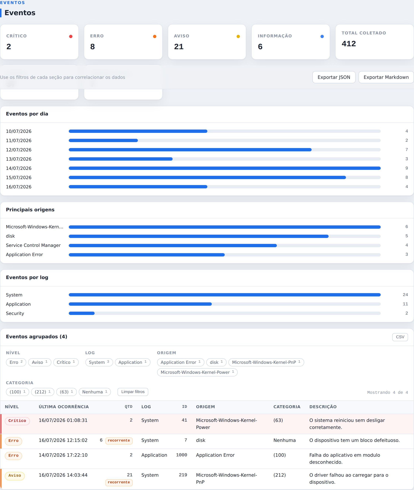

**Objetivo da tela:** resumir os **avisos do Windows** dos últimos dias, reduzindo o ruído.

- **O que cada informação representa:**
  - **Cartões por nível:** quantos eventos Críticos, Erros, Avisos e Informação foram coletados no período, além do total e da quantidade de grupos.
  - **Gráficos:** "Eventos por dia" (com datas em dd/MM/yyyy), "Principais origens" e "Eventos por log".
  - **Tabela de eventos agrupados:** eventos semelhantes são reunidos em grupos, mostrando nível, última ocorrência, quantidade, log, ID, origem, categoria e descrição. Grupos que se repetem recebem o selo **"recorrente"**.
- **Como interpretar:** foque nos **Críticos** e **Erros**, especialmente os **recorrentes** — repetições costumam apontar a causa raiz. Use os gráficos para localizar o componente (origem/log) mais problemático.
- **Cenários/problemas identificáveis:** reinícios inesperados (Kernel-Power), erros de disco recorrentes, falhas de aplicativo, drivers que não carregam.
- **Ações possíveis:** investigar o componente indicado pela origem; um erro de disco recorrente, por exemplo, sugere verificar a saúde do HD/SSD e fazer backup.

---

### 6.9 Serviços

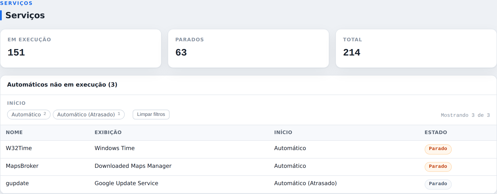

**Objetivo da tela:** destacar **serviços automáticos que não estão em execução** — ou seja, que deveriam estar ligados e não estão.

- **O que cada informação representa:**
  - **Cartões:** total de serviços, quantos estão em execução e quantos parados.
  - **Tabela:** os serviços automáticos parados, com nome, exibição, **tipo de início** e estado. O tipo distingue "Automático" de "Automático (Atrasado)".
- **Como interpretar:** um serviço "Automático" parado costuma ser relevante. Já um **"Automático (Atrasado)"** que concluiu sua tarefa e parou pode ser comportamento normal — por isso é sinalizado com cor mais branda.
- **Cenários/problemas identificáveis:** um serviço essencial (ex.: Windows Time) parado; um serviço de segurança que deveria estar ativo.
- **Ações possíveis:** iniciar o serviço necessário e verificar por que ele não subiu; se for um serviço de início atrasado que já cumpriu sua função, geralmente nenhuma ação é preciso.

---

## 7. Fluxo recomendado para interpretar o relatório

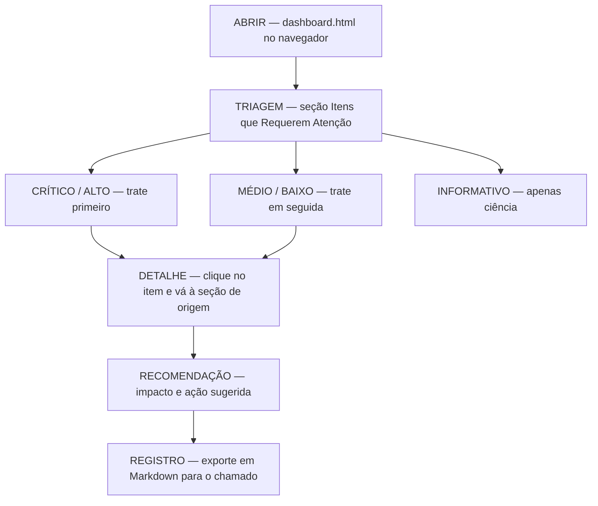

1. Abra o relatório e olhe **Itens que Requerem Atenção**.
2. Comece pelos itens **vermelhos (Crítico)** e **laranja (Alto)**.
3. **Clique** no item para ver os detalhes e a recomendação.
4. Só depois desça para os amarelos, verdes e azuis.
5. Use as demais seções para aprofundar (Segurança, Eventos, Serviços, Processos, Rede).

**Exemplo prático:** o relatório mostra, em laranja, "3 serviço(s) automático(s) parado(s)". Você clica e vai à seção **Serviços**, com a lista exata. Com isso, você (ou o suporte de TI) decide se liga aqueles serviços.

**Outro exemplo:** aparece um item vermelho "Windows não ativado". O WRA leva você ao **Resumo do sistema**, que mostra o estado da licença — então você sabe que precisa ativar o Windows.

> Importante: o WRA **aponta**, não conserta. Cada recomendação é um ponto de partida para você decidir com segurança.

---

## 8. Onde os relatórios ficam salvos

Tudo fica **na própria pasta do WRA**, na subpasta `Reports`:

- Cada verificação cria uma pasta com data e hora.
- O relatório mais recente também fica em `Reports\Latest`.
- Para reabrir o último relatório, use a opção **`8`** do menu.

O arquivo principal chama-se **`dashboard.html`** — é ele que abre no navegador. Você pode copiá-lo para outro computador ou anexá-lo a um e-mail. Pelo próprio relatório é possível ainda **Exportar Markdown** (um arquivo `.md` de texto com todo o conteúdo, organizado e legível) e **Exportar JSON** (dados brutos). Junto da execução são gerados também um `data.json` e arquivos `.csv` das tabelas.

---

## 9. Licenciamento do Windows

A seção **Resumo do sistema** exibe o **estado da licença do Microsoft Windows** (não do WRA), lido dos mecanismos oficiais do próprio Windows. Quando disponíveis, aparecem:

- **Situação** — *Licenciamento Permanente*, *Licença válida por N dias*, *Período de avaliação (Evaluation)*, *Windows não ativado* ou *Necessita reativação*.
- **Status de ativação**, **Edição** (ex.: Windows 11 Pro), **Tipo** (OEM, Retail, Volume MAK, Volume KMS, Digital, Avaliação), **Canal** e **Expiração** (data + dias restantes, quando houver prazo).

Se o Windows não estiver ativado, estiver expirado ou precisar de reativação, isso também aparece em **Itens que Requerem Atenção**, com a prioridade adequada. Essas informações são apenas exibidas — o WRA **não altera** a ativação.

---

## 10. Perguntas frequentes e solução de problemas

**O WRA pode estragar ou alterar meu computador?**
Não. Ele só lê informações e gera o relatório. Não altera configurações, não instala e não remove nada — inclusive não mexe na ativação do Windows.

**Preciso de internet?** Não. Funciona totalmente offline.

**Por que executar como administrador?** Sem isso, algumas verificações (segurança, serviços, licença) ficam incompletas. Como administrador, o relatório fica completo.

**Onde vejo rapidamente o que resolver?** Na primeira seção, "Itens que Requerem Atenção", começando pelas cores vermelha e laranja.

**Posso agendar para rodar sozinho?** Sim — opção **`9`** do menu (verificação diária).

### Solução de problemas comuns

| Problema | O que fazer |
|----------|-------------|
| A janela preta abre e fecha rápido | Clique com o botão direito no `Launcher.bat` e escolha "Executar como administrador". |
| O relatório veio vazio ou com poucos dados | Rode novamente como administrador — muitas informações exigem essa permissão. |
| Aparece "Windows não ativado" | O computador está mesmo sem ativação; ative o Windows com uma licença válida. |
| A licença aparece como "Não identificado" | Alguns sistemas não expõem todos os detalhes; o status de ativação ainda é mostrado. |
| Não sei qual arquivo abrir | Abra o `dashboard.html` em `Reports\Latest`, ou use a opção `8` do menu. |
| Quero ver um relatório antigo | Todos ficam em `Reports\`, em pastas com data e hora. |

---

## 11. Boas práticas

- **Rode como Administrador** quando precisar do relatório completo.
- **Arquive os relatórios** (ou o `data.json`) para comparar a evolução da máquina ao longo do tempo.
- **Comece sempre pela seção de atenção**, seguindo as cores.
- **Não dependa do WRA para corrigir** — ele diagnostica; a correção é decisão e ação sua.
- **Mantenha a estrutura de pastas intacta** — a ferramenta resolve caminhos relativos a si mesma.

---

## 12. Para usuários avançados

### Arquitetura em camadas

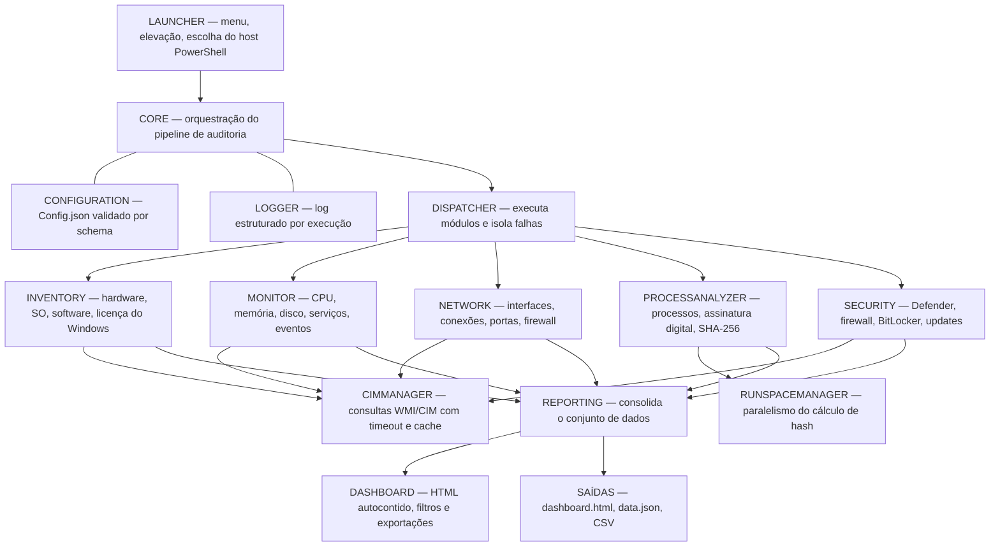

Detalhes técnicos ficam na pasta `Docs/`:

- **`Docs/Usage-Guide.md`** — uso detalhado e linha de comando.
- **`Docs/Configuration-Reference.md`** — opções do `Config/Config.json`.
- **`Docs/Module-Reference.md`** — o que cada módulo coleta.
- **`Docs/Troubleshooting.md`** — solução de problemas avançada.
- **`Docs/01-Arquitetura-Geral.md`** — arquitetura interna.
- **`Docs/LICENSING.md`** — guia de conformidade da licença.

Resumo para quem tem pressa:

- Linha de comando: `Launcher.bat -Run All` (ou módulos específicos, ex.: `-Run Security,Network`).
- Forçar o host: `--ps5` (Windows PowerShell) ou `--ps7` (PowerShell 7+).
- Saídas em HTML, JSON e CSV em `Reports\<data_hora_maquina>\`; pelo dashboard há ainda exportação em Markdown (.md) com o conteúdo integral do relatório.
- SHA-256 calculado inclusive para processos protegidos (PPL), via resolução oficial do caminho da imagem.
- Somente leitura por princípio de projeto (`Safety.ReadOnly` / `Safety.NeverModifySystem`).
- Datas exibidas seguem o padrão brasileiro `dd/MM/yyyy`; formatos internos (nomes de pasta, ISO em `data.json`) são preservados para ordenação e integração.

---

## 13. Versão, licença e créditos

**Versão atual:** 1.1.0. O histórico completo está em [`CHANGELOG.md`](CHANGELOG.md).

O WRA adota versionamento semântico público a partir da linha **1.x**. Após um longo ciclo de desenvolvimento e uso interno em ambiente local, a `1.0.0` marcou a primeira base pública estável e a **`1.1.0`** consolida as melhorias aplicadas até esta publicação (relatório orientado a *Itens que Requerem Atenção*, licença do Windows detalhada, filtros, análise de eventos e uma ampla revisão de qualidade). O histórico público começa nesta versão.

### Licença

Este projeto é licenciado sob a **Apache License, Version 2.0** (Apache-2.0) — uma licença open source permissiva que permite usar, copiar, modificar e distribuir o software, inclusive em projetos comerciais, desde que você preserve os avisos de copyright e licença, inclua uma cópia da licença e mantenha o arquivo `NOTICE`.

- Texto completo: [`LICENSE`](LICENSE)
- Avisos de atribuição: [`NOTICE`](NOTICE)
- Guia de conformidade: [`Docs/LICENSING.md`](Docs/LICENSING.md)
- Documentação oficial: https://www.apache.org/licenses/LICENSE-2.0

```
Copyright 2023-2026 Edsilas

Licensed under the Apache License, Version 2.0 (the "License");
you may not use this file except in compliance with the License.
You may obtain a copy of the License at

    http://www.apache.org/licenses/LICENSE-2.0

Unless required by applicable law or agreed to in writing, software
distributed under the License is distributed on an "AS IS" BASIS,
WITHOUT WARRANTIES OR CONDITIONS OF ANY KIND, either express or implied.
See the License for the specific language governing permissions and
limitations under the License.
```

---

**Windows Resource Auditor v1.1.0** — Desenvolvido por Edsilas.
